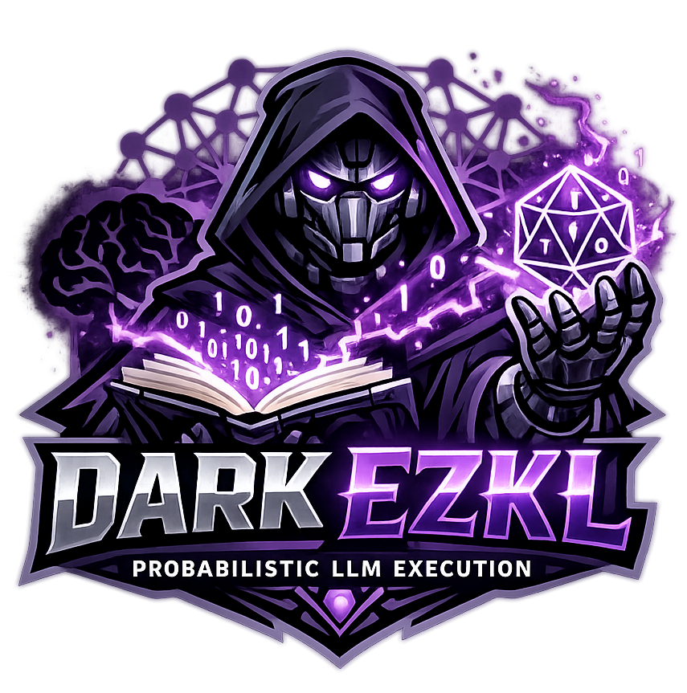

<h1 align="center">
	<br>
	Dark-EZKL
	<br>
	
	<br>
</h1>

> A scaling-focused fork of EZKL for ZKML on large Transformer / LLM-style models.

This repository contains **Dark-EZKL**: a research-oriented fork of the upstream **EZKL v23.0.3** project (original: `zkonduit/ezkl`). Dark-EZKL focuses on **making large-model ZK inference more practical** by introducing a **probabilistic verification execution mode** (e.g. Freivalds-style checks for expensive linear algebra) and by documenting/benchmarking scaling behavior.

---

## Key docs (start here)

- **Probabilistic verification (design, knobs, security notes):** `PROBABILISTIC.md`
- **Benchmarks (what is measured + how to interpret outputs):** `BENCHMARKS.md`

---

## Built-in benchmark models (defaults)

The benchmark runner ships with a few built-in models (exported to ONNX by the runner):

- `lenet-5-small`
- `vit`
- `repvgg-a0`

(See `BENCHMARKS.md` for what each run measures and what artifacts are produced.)

---

## Run the benchmarks in Docker (recommended)

### Host requirements

- Docker
- **NVIDIA GPU** + driver
- NVIDIA Container Toolkit installed (so Docker can access GPUs)

If you *don’t* have a GPU, you can still try running without `--gpus all`, but performance will be much slower and some configurations may not work.

---

## 1) Build the Docker image

From the repo root:

```bash
docker build -t dark-ezkl:bench .
```

This image compiles:
- the `ezkl` CLI (from `./ezkl`)
- the Python wheel/bindings used by the benchmark scripts

Build time can be substantial (Rust + CUDA/PyTorch base).

---

## 2) Prepare host output/cache directories (recommended)

These mounts make reruns much faster (weights + SRS + HF/Torch caches persist on the host):

```bash
mkdir -p results cache .ezkl
```

- `./results`  → benchmark outputs (JSON reports + artifacts per run)
- `./cache`    → Torch/HuggingFace/ONNX caches
- `./.ezkl`    → EZKL SRS cache (e.g. `./.ezkl/srs/`)

---

## 3) Quick sanity check: GPU visible in container

```bash
docker run --rm --gpus all \
  dark-ezkl:bench \
  python3 -c "import torch; print('cuda available:', torch.cuda.is_available())"
```

---

## 4) Run benchmarks

### Quick test (recommended for first run)

```bash
docker run --rm --gpus all --shm-size=16g \
  -v "$PWD/results:/app/results" \
  -v "$PWD/cache:/app/.cache" \
  -v "$PWD/.ezkl:/root/.ezkl" \
  dark-ezkl:bench \
  python3 /app/benchmark.py --outdir /app/results \
    --models lenet-5-small \
    --prob-k-values 2 \
    --runs 1
```

### Full benchmark suite (11-21 hours)

This runs the **complete** matrix of cases (3 models × 2 prob_k × 3 runs = 18 tests):

```bash
docker run --rm --gpus all --shm-size=16g \
  -v "$PWD/results:/app/results" \
  -v "$PWD/cache:/app/.cache" \
  -v "$PWD/.ezkl:/root/.ezkl" \
  dark-ezkl:bench \
  python3 /app/benchmark.py --outdir /app/results
```
### What you get (suite)
- `results/benchmark.json` (suite summary: cases + aggregates + env)
- `results/runs/<model>/k<prob_k>/run<i>/...` (per-run directories + artifacts)
  - each run includes a `vit_bench_report.json` (name is historical; it’s used for all models)

---

## 5) Run a single model once (bench_vit.py)

Use this when iterating/debugging or when you only want LeNet / ViT / RepVGG.

### LeNet (single run)

```bash
docker run --rm --gpus all --shm-size=16g \
  -v "$PWD/results:/app/results" \
  -v "$PWD/cache:/app/.cache" \
  -v "$PWD/.ezkl:/root/.ezkl" \
  dark-ezkl:bench \
  python3 /app/bench_vit.py \
    --outdir /app/results/single/lenet_k4 \
    --model-name lenet-5-small \
    --prob-k 4 \
    --prob-ops MatMul,Gemm,Conv \
    --prob-seed-mode fiat_shamir
```

### ViT (single run)

```bash
docker run --rm --gpus all --shm-size=16g \
  -v "$PWD/results:/app/results" \
  -v "$PWD/cache:/app/.cache" \
  -v "$PWD/.ezkl:/root/.ezkl" \
  dark-ezkl:bench \
  python3 /app/bench_vit.py \
    --outdir /app/results/single/vit_k4 \
    --model-name vit \
    --prob-k 4 \
    --prob-ops MatMul,Gemm,Conv \
    --prob-seed-mode fiat_shamir
```

### RepVGG (single run)

```bash
docker run --rm --gpus all --shm-size=16g \
  -v "$PWD/results:/app/results" \
  -v "$PWD/cache:/app/.cache" \
  -v "$PWD/.ezkl:/root/.ezkl" \
  dark-ezkl:bench \
  python3 /app/bench_vit.py \
    --outdir /app/results/single/repvgg_k4 \
    --model-name repvgg-a0 \
    --prob-k 4 \
    --prob-ops MatMul,Gemm,Conv \
    --prob-seed-mode fiat_shamir
```

### What you get (single run)

Under the `--outdir` you pass (e.g. `results/single/vit_k4/`):

- `vit_bench_report.json` (the measured timings + logrows + paths to artifacts)
- various EZKL artifacts (settings, compiled circuit, keys, witness, proof, etc.)

See `BENCHMARKS.md` for the meaning of each timing key.

---

## Notes / troubleshooting

### 1) First run downloads weights/datasets
Depending on the model, first run may download:
- torchvision weights (ViT)
- timm weights (RepVGG)
- datasets (LeNet training or data generation, depending on runner behavior)

Mounting `./cache:/app/.cache` avoids redownloading.

### 2) SRS downloads can be large
`ezkl get-srs` downloads the SRS for the chosen `logrows`.
Mounting `./.ezkl:/root/.ezkl` avoids re-downloading across runs.

### 3) ViT is heavy
`vit` can require higher `logrows` and significant RAM/VRAM.
If it fails, start with:
- fewer/lower `--prob-k`
- running a smaller model first (LeNet)
- increasing host resources

### 4) Where to look when something fails
Start with the per-run JSON report:
- `results/.../vit_bench_report.json`

It contains paths to the exact artifacts used for that run (settings, compiled circuit, witness, proof).

### 5) MNIST “HTTP Error 404” during download is expected
Torchvision’s MNIST downloader tries an old mirror first, then automatically falls back to an alternate mirror.
If the download eventually succeeds and extraction proceeds, you can ignore the earlier 404 lines.

### 6) PyTorch `TracerWarning` during export is expected
Warnings like:
- `TracerWarning: Converting a tensor to a Python boolean might cause the trace to be incorrect...`

usually occur during tracing / ONNX export. They are non-fatal for this benchmark flow.

### 7) “Is it stuck?” checklist
If you’re unsure whether the benchmark is still making progress:

- Check the container is still alive:
  - `docker ps`
- Check GPU/CPU activity:
  - `nvidia-smi -l 1`
  - `top` / `htop`
- Check the host-mounted output directory is changing:
  - new per-run folders under `results/runs/...`
  - a `vit_bench_report.json` appears when a run finishes
- Check the host-mounted `.ezkl/` is growing (SRS download / cache), especially on the first run.

If everything is idle for a long time (e.g. 10–15+ minutes) and there are no new files being written,
rerun a *single* small case first (`bench_vit.py --model-name lenet-5-small`) to validate the pipeline end-to-end.

---
